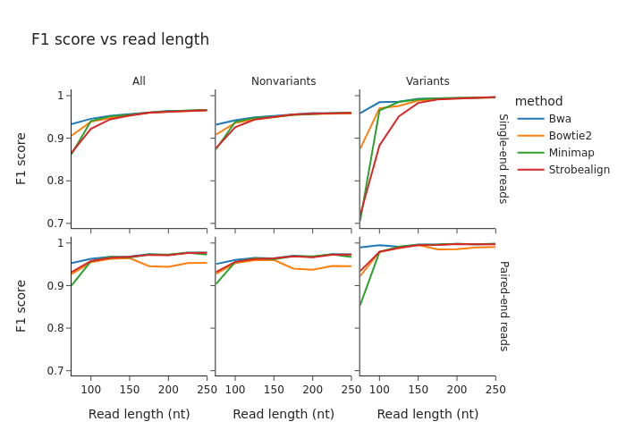

# Report, created  2023-03-07 19:20

Note: This pipeline is under development, and the results may be wrong or inaccurate.

 

 Accuracy vs. read length for paired/single end reads. Divided into reads containing and not containing genomic variants.

 [Link to plot data](presets/f1_score_vs_read_length.md) 

 

  [Link to plot data](presets/accuracy_for_various_mapq_thresholds_human_whole_genome.md) 

 

  [Link to plot data](presets/runtime_human_whole_genome.md) 

 

 Run on a small genome (chr17-21). Shows precision/recall for various MAPQ thresholds.

 [Link to plot data](presets/variant_calling_accuracy_vs_mapq_threshold.md) 

 

  [Link to plot data](presets/accuracy_vs_read_length_and_error_profile_human_whole_genome.md) 

 

  [Link to plot data](presets/memory_human_whole_genome.md) 

